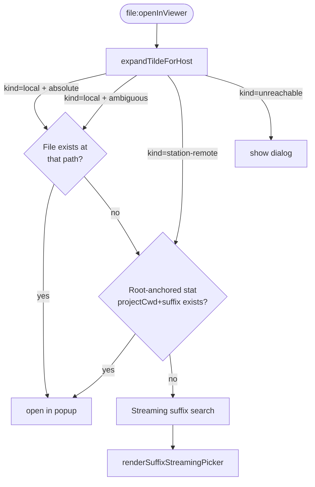

# Suffix-Search Architecture (Satellite)

This document explains how a Cmd+click on a path in a Reck Connect pane
resolves to either an opened file, a streaming "looking for matches…"
picker, or a "create file?" banner. It covers the routing rules, the
three-layer resolution pipeline, and the three streaming-search backends
introduced in Round 8.6.

For the upstream rendering pipeline (text → clickable links → IPC), see
[`rendering-architecture-satellite.md`](./rendering-architecture-satellite.md).
For the high-level station/satellite topology, see
[`architecture.md`](./architecture.md).

---

## 1. Input classification

Every Cmd+click sends an IPC `file:openInViewer` payload that includes:

| Field | What it means |
|---|---|
| `path` | The raw clicked text (may be absolute, tilde-anchored, or project-relative) |
| `sourceHost` | `"local"` if the click came from a local pane; `"station"` if from a station pane |
| `projectCwd` | Absolute station-side cwd of the pane that fired the click (e.g. `/home/pi/projects/MyProject`) |
| `originalText` | The raw token before any pre-processing |

The handler in `satellite/main/file-viewer.ts` runs the payload through
`expandTildeForHost(raw, opts)` first, which classifies the input into
one of three resolved shapes:

```
ExpandedPath =
  | { kind: "local";          path: absMacPath }   // open directly
  | { kind: "station-remote"; path: absPiPath }    // SSH read-only popup
  | { kind: "unreachable";    reason: string }     // surface error dialog
```

### Decision table

| sourceHost | path shape | projectCwd? | Result | Why |
|---|---|---|---|---|
| local | absolute `/abs/path` | — | `local` | pass-through |
| local | tilde `~/...` | — | `local` | expand against local home |
| local | relative `foo/bar` | — | `local` (unchanged) | local cwd convention |
| station | absolute under `stationRoot` | — | `local` (mount mirror) | translate `/home/pi/projects/X` → `~/reck/projects/X` |
| station | absolute outside `stationRoot` | — | `station-remote` | SSH read-only (e.g. `/etc/passwd`) |
| station | tilde `~/...` | — | join with `stationHome` → recurse | route via above rules |
| station | relative `services/foo/bar.py` | set | `local` (mount mirror) | **Round 8.6 fix** — prepend `projectCwd`, then translate |
| station | relative `services/foo/bar.py` | absent | `station-remote` (legacy) | preserves old SSH-read fallback when no projectCwd context |
| station | relative + projectCwd outside `stationRoot` | set | `station-remote` | joined absolute is on Pi but outside the mount |

The **Round 8.6 row** is what fixed this misrouting. Before this row existed,
a project-relative click in a station pane was misrouted to
`station-remote` with the bare relative path, which broke every
downstream layer.

---

## 2. The three resolution layers

After classification, the handler descends through three layers in
order. The first layer that produces a hit wins; no later layer runs
for that click.



### Layer 1 — `resolveInsideAllowedRoots`

A single synchronous filesystem check against the absolute path. Almost
all clicks resolve here: an absolute path or a fully-anchored station
path (after Phase 1 routing prepends `projectCwd`) just opens.

Implementation: `satellite/main/file-allowlist.ts` →
`resolveInsideAllowedRoots(roots, candidatePath)`.

### Layer 2 — Root-anchored stat fast-path *(Round 8.6 Phase 2)*

Before launching any streaming walker, the orchestrator races a single
`fs.stat(projectCwd + originalText)` against a 300 ms timeout (default).
On hit it emits one synthetic `match` + `done` event — no worker spawn,
sub-100 ms latency.

The hit case dominates whenever the user clicks a path printed using
the project's standard root-relative convention (`services/foo/bar.py`).
Misses (typos, sub-cwd-printed paths) fall through to Layer 3.

Implementation: `satellite/main/suffix-search-orchestrator.ts` →
`StartSuffixSearchArgs.anchoredStat`. Wired by the file-viewer IPC
handler from `projectCwdForSearch` + `originalText`.

### Layer 3 — Streaming suffix search

Spawns a worker that enumerates the project tree and streams matches
into the popup picker. The user sees results as they arrive and can
hit "Stop searching" to bail.

Implementation: `satellite/main/suffix-search-orchestrator.ts` ↔
`satellite/renderer/src/viewer/FileViewerHost.ts` →
`renderSuffixStreamingPicker`.

The orchestrator is **backend-agnostic** — it takes a per-call
`workerFactory` and optionally a `fallback: { factory, when, onStart? }`
descriptor (Round 8.6 Phase 3d). The IPC handler picks which factories
to pass based on what's available.

---

## 3. The three search backends

| Backend | File | When picked | Speed (first match) |
|---|---|---|---|
| `rg --files` local | `search-worker-rg-local.ts` | ripgrep installed on this Mac | ~0.5–2 s |
| Readdir walker | `search-worker.ts` (worker_threads) | ripgrep NOT installed locally | ~3–20 s (sshfs) |
| `rg --files` over SSH | `search-worker-rg-ssh.ts` | sourceHost=station + ripgrep on Pi + primary returned 0 | ~0.2–0.5 s |

All three implement the `StreamingWorkerLike` interface
(`postMessage(start|stop)`, `on(message|exit|error)`, `terminate()`)
so the orchestrator wires them identically.

### Backend selection

`satellite/main/file-viewer.ts` → `pickSearchBackend(sourceHost,
onFallbackStart?)`:

1. **Primary** = local `rg` if `searchBackends.hasLocalRg()` resolves
   true; else the legacy readdir walker.
2. **Fallback** = SSH `rg` if `sourceHost === "station"` AND
   `searchBackends.hasSshRg()` resolves true. Fires only after primary
   completes with `totalFound === 0`.

Detection is memoised per process (`backend-detection.ts`).

### Why this layering

| Failure class | Caught by |
|---|---|
| File exists at the printed path | Layer 1 |
| File exists at `projectCwd + printedPath` | Layer 2 |
| File at unusual depth in the project | Layer 3 primary (rg-local or walker) |
| File only on Pi (sshfs hasn't cached yet) | Layer 3 fallback (rg-ssh) |
| File doesn't exist anywhere | Layer 3 with `totalFound === 0` → create-banner |

---

## 4. The streaming-picker UX

The popup's `renderSuffixStreamingPicker` doesn't know which backend is
running. It listens for four IPC events from main:

| IPC channel | Picker reaction |
|---|---|
| `file:suffix:match` | Append a row, animate it in |
| `file:suffix:progress` | Update the "scanned N dirs" counter |
| `file:suffix:done` | Hide the spinner; show "0 matches" + create-banner if N=0 |
| `file:suffix:fallback-start` *(Round 8.6)* | Optional: show "checking station…" interstitial banner between waves |

The fallback signal is emitted by the orchestrator's
`fallback.onStart()` callback (which the IPC handler wires to a
`safeSend` of `file:suffix:fallback-start`). Renderer rendering of that
event is optional — the picker still works without it; the user just
sees a brief pause before SSH results stream in.

---

## 5. Cancellation

Every layer wires cancel-on-close cleanly:

- Layer 1: synchronous, nothing to cancel.
- Layer 2: anchored-stat race with a 300 ms timeout; if the picker is
  cancelled during the in-flight stat, the handle's `cancel()` fires
  `onCancelled` without ever spawning a worker.
- Layer 3 primary: handle.cancel() posts `{type: "stop"}` to the worker
  AND calls `terminate()`. The worker SIGTERMs its child (rg) and exits.
- Layer 3 fallback: same. If cancel fires *between* primary-done and
  fallback-spawn, `fallbackUsed` is set so it never spawns.

Implementation: `satellite/main/suffix-search-orchestrator.ts` →
`finalize()` is single-fire; all paths funnel through it.

---

## 6. Security and quoting

The SSH fallback runs untrusted-looking paths through a defensive
single-quote escape (`'\''`) inside the remote shell command. Roots
are also validated against a conservative regex
(`/^\/[A-Za-z0-9._/\- ']*$/`) that rejects `;`, `|`, `$`, backticks,
and newlines before the spawn happens. See
`satellite/main/search-worker-rg-ssh.ts` →
`isSafeRoot` + `singleQuoteEscape`.

For Pi-side file reads/writes the same philosophy is enforced by
`isStationPathSafe` in `satellite/main/station-ssh.ts`.

---

## 7. Related history (LEARNINGS)

- Round 6 Phase CC — original streaming search; introduced worker_threads + suffix walker
- Round 7 Phase GG — raised walker timeout from 2 s → 30 s; added Stop button
- Round 8 Phase NN — `composeSuffixSearchRoots` combines projectCwd + searchBase
- Round 8.1 Phase QQ/RR/SS — per-readdir 3 s timeout, mount-stall banner, popup retry
- Round 8.5 — diagnostic `[click:*]` logging surface (parallel to this work)
- **Round 8.6** — this document: input-classification fix + fast-path + rg backends

See `docs/LEARNINGS.md` for the date-stamped narrative of each round.
