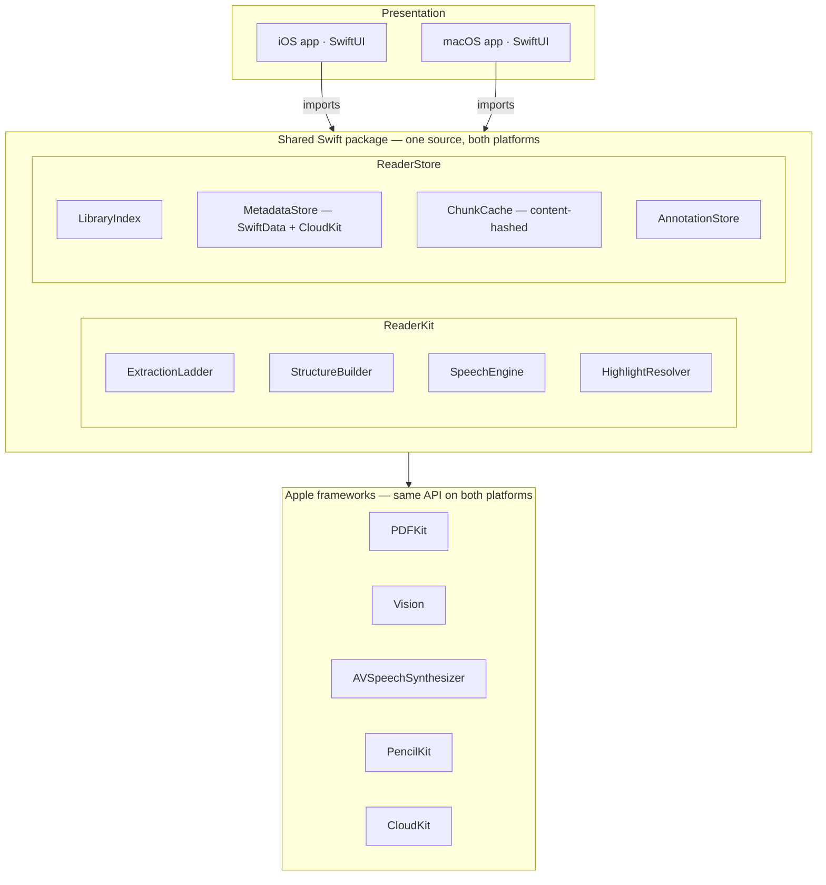
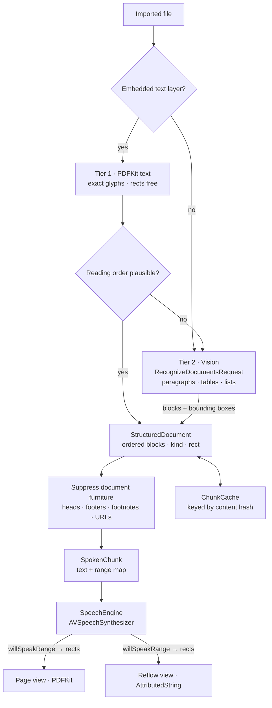

# Reader — design

An all-local document reader that speaks. Native Apple voices, word-level
highlighting, a PDF pipeline that keeps its reading order straight, and — later
— notes taken while listening. iPhone first, Mac second, no server at any point.

Visual version, with diagrams and all external sources:
<https://claude.ai/code/artifact/35231a57-9137-4997-9226-b09569ae0bd2>

Research brief that led here:
<https://claude.ai/code/artifact/cf30f29f-d9e4-4639-aef9-c4bf9d3920ef>

## 1. Thesis

Open a document, press play, follow the highlight, keep your place. Everything
runs on the device; the only network Reader touches is iCloud, and only to sync
your own files between your own machines.

The reading engine is a port of reck-connect's satellite TTS system — the same
`SpokenChunk` contract, the same surface-adapter shape, the same voice-selection
heuristics, the same highlight treatment. What does *not* port is the ~500 lines
of Chromium workarounds in `satellite/renderer/src/tts/TtsEngine.ts`, which exist
only because the Web Speech API is a poor wrapper over `AVSpeechSynthesizer`:
the cancel-based pause, the 80ms cancel cooldown, the `≠` poison-character
blocklist, the degenerate-boundary detector, the 2000-char utterance cap, the
stall watchdog. None have native equivalents.

Also dropped: `wordLocator.relocateWord` and `tailDivergence`. They exist because
xterm repaints cells in place, so a captured position goes stale. A PDF page does
not repaint underneath you. (They are also the likely source of the intermittent
same-word highlight jump — the forward-preference scoring picks a wrong duplicate
when the true occurrence scrolls behind the hint.)

## 2. Decisions

| Question | Decision | Because | Would reverse if… |
|---|---|---|---|
| React Native or Swift? | Swift, shared core | Expo does not support macOS; no RN library gives per-word rects on a rendered PDF page. Both hard parts are Swift regardless. | the app were mostly chrome with speech as a thin feature |
| Where do files live? | App-owned library in the iCloud container, `NSUbiquitousContainerIsDocumentScopePublic` so it stays visible in Finder and Files | Identical on both platforms; file sync free, position sync nearly free | you want to read files in place from arbitrary folders |
| Convert PDF to HTML? | No — one StructuredDocument, two renderers | Exact HTML reconstruction and reflow are opposites; pdf2htmlEX is unmaintained; PDFKit already yields rects | complex tables or math need CSS-grade layout in reflow |
| Which platform first? | iPhone | User's call; also forces the reflow view early | — |
| Backend? | None through phase 5 | Every module is an in-process Swift type; CloudKit is Apple's infrastructure | notes must be readable from non-Apple tools |

## 3. Architecture

There is no network tier: nothing to deploy, operate, or pay for.

### Modules

| Module | Layer | Responsibility | Phase |
|---|---|---|---|
| `ExtractionLadder` | ReaderKit | Tier 1 PDFKit → tier 2 Vision; records which tier won | 2 |
| `StructureBuilder` | ReaderKit | Blocks into reading order; suppresses running heads, footnotes, citations, bare URLs | 2 |
| `SpeechEngine` | ReaderKit | `AVSpeechSynthesizer`; maps `willSpeakRange` into chunk coordinates | 1 |
| `VoiceCatalog` | ReaderKit | Voice scoring: premium > enhanced > classic; novelty voices excluded | 1 |
| `HighlightResolver` | ReaderKit | Range → rects, asked of whichever source produced the chunk | 1 |
| `LibraryIndex` | ReaderStore | Projects as folders; import, move, delete | 3 |
| `MetadataStore` | ReaderStore | Reading position, voice, rate — SwiftData synced by CloudKit | 3 |
| `ChunkCache` | ReaderStore | Parsed documents keyed by content hash; local only | 2 |
| `AnnotationStore` | ReaderStore | Ink, typed notes, highlights, spoken-range marks | 5 |
| `NoteIndex` | ReaderStore | Cross-document note search and tagging | 6 |
| `ExportService` | ReaderStore | Notes as Markdown or JSON | 6 |

## 4. Document pipeline

Two gateways, and they are distinct: tier 1 can succeed at *extraction* and still
fail at *order*, which is exactly the failure Apple's forums document for
two-column PDFs. Plausibility is therefore checked separately from success.

**Why a StructuredDocument rather than a flat chunk.** Suppressing a running
header requires knowing a block *is* one. Cropping a figure into reflow needs its
rect. Resuming at "the paragraph I was on" needs paragraph boundaries. All three
fall out of keeping structure and deriving the flat chunk from it.

**Figures in reflow are not reconstructed.** Non-text blocks are cropped from the
page render at their bounding box and inlined as images in reading order.
Equations, tables, diagrams and photographs all take that path — reflow never
fights CSS trying to rebuild a matrix.

## 5. Features by phase

**Reading** — import via Share sheet / Files / Open With (1); PDF, Markdown,
plain text (1); page view (2); reflow view with font size, line width, theme (2);
outline (2); in-document search (3); EPUB and HTML (6).

**Speech** — play/pause/stop (1); rate 0.5×–6× changeable mid-sentence (1); word
highlight, translucent fill + opaque ring (1); voice picker with quality scoring
(1); background audio + lock screen controls (1); position remembered (1);
tap-a-word-to-start-here (2); skip sentence/paragraph (2); language auto-detect
(2); sleep timer (3); auto-advance within a project (3); pronunciation overrides (6).

**Library** — projects as nestable folders (3); visible in Finder and Files (3);
iCloud sync of files and position (3); continue reading (3); per-document
progress (3); library-wide search (6).

**Annotation** — PencilKit ink (5); typed notes anchored to a rect (5); text
highlight, underline, strikethrough (5); **mark while listening** — one tap
captures the sentence being spoken, its page and its rect (5); annotations sync
with the document (5).

**Notes library** — note = quoted source + your words + anchor (6);
cross-document browser and tags (6); full-text search (6); export to Markdown and
JSON (6); tap a note to jump back to its page (6); local retrieval API (6).

**Out of scope** — cloud voices; RSS, CarPlay, Watch; docx/pptx/odt/odp;
accounts, collaboration, sharing; handwriting recognition on your own ink.

"Mark while listening" is the feature that justifies the annotation phase: it is
the one thing only a reader that *also* speaks can offer, and the reason notes
belong in this app rather than a separate one.

## 6. Roadmap — iPhone first

**Phase 0 — spikes.** Pure Swift, no UI. Done when we know: (1) whether macOS 26
/ iOS 26 PDFKit still returns out-of-order text on real PDFs; (2) whether
`characterBounds(at:)` is fixed; (3) whether Vision beats PDFKit on a two-column
paper; (4) whether `willSpeakRange` fires correctly on Premium and Personal
voices; (5) what a 300-page PDF costs in memory when rendered for Vision.

**Phase 1 — iPhone MVP.** Share a file in, press play, native voice, word
highlight, rate and voice controls, background playback with lock screen
controls, position remembered. One document at a time; no library. Done when you
listen to a real document end to end with the screen off and it resumes.

**Phase 2 — PDF ladder and reflow.** Both tiers, furniture suppression, figure
cropping, reflow renderer, tap-to-read-from-here. Done when a two-column paper
reads in the right order without speaking its page numbers, and its figures
appear inline in reflow.

**Phase 3 — library, projects, sync.** iCloud container, folders, import,
continue-reading, CloudKit metadata sync. Done when a folder imported on one
device appears with positions on another.

**Phase 4 — the Mac app.** Second SwiftUI shell over the identical core, plus
Finder Open With and drag-drop. Done when it ships with no changes to `ReaderKit`
beyond additive API — if that's hard, the core boundary was drawn wrong.

**Phase 5 — annotation.** Done when you annotate on iPad and see it on the Mac.

**Phase 6 — notes library and export.** Done when you can pull a project's notes
as JSON from another tool on your own machine.

## 7. Backend

None through phase 5. Phase 6's "API" has three shapes, in preference order:

1. **Export files** — notes written as Markdown into the project folder, synced
   by iCloud like everything else. Zero infrastructure, readable by every tool
   you own. Start here.
2. **A local HTTP endpoint on the Mac** — Bonjour-advertised, bound to localhost,
   serving JSON from `NoteIndex`. A process on your laptop, not a deployment.
3. **A hosted service** — only if notes must be readable from non-Apple tools
   anywhere. Real auth, storage and operational burden; nothing before phase 6
   should be shaped around the possibility.

## 8. Data model

| Type | Shape | Stored | Synced |
|---|---|---|---|
| `Project` | A folder; name and nesting from the filesystem | iCloud container | Yes (iCloud) |
| `Document` | File URL, stable UUID, content hash, format | iCloud container | Yes (iCloud) |
| `StructuredDocument` | Ordered `[Block]` | ChunkCache | No — reproducible |
| `Block` | kind (heading, paragraph, list, table, figure, caption, head, footer, footnote), order, page, rect, text or image ref | ChunkCache | No |
| `SpokenChunk` | text + range map, derived from blocks | Memory | No |
| `ReadingState` | document, char offset, voice, rate, updated-at | SwiftData | Yes (CloudKit) |
| `Annotation` | document, page, rect, kind, payload, spoken range, quoted text | SwiftData | Yes (CloudKit) |
| `Note` | annotation ref, body, tags | SwiftData | Yes (CloudKit) |

Rule: anything reproducible from the source file is never synced. Only
irreplaceable data — position, annotations, notes — travels.

## 9. Error handling

- Order looks wrong → fall to tier 2 automatically, record which tier won.
- Both tiers fail → "Couldn't find readable text — this may be a scan without a
  text layer," with a *Run OCR* action, not a dead end.
- Encrypted PDF → prompt for the password.
- Preferred voice missing → fall through `VoiceCatalog`; never let the system
  pick, which is how you get Albert.
- iCloud unavailable → read locally, banner says sync is paused. Reading never
  blocks on the network.
- Huge document → extract page-lazily; never hold 300 rendered pages.

## 10. Testing

- `SpeechEngine` takes a `SpeechSynthesizing` protocol, not the concrete class —
  the same injection that lets reck-connect's engine be driven by a fake across
  1186 lines of tests.
- Golden-file extraction tests: a corpus of real PDFs with expected reading
  order, so a tier change is a diff rather than a feeling.
- Structure classification tested per block kind against hand-labelled pages.
- Snapshot tests on both renderers.
- Nothing above the shell requires a simulator.

## 11. Open questions

The five phase-0 spikes above. The PDFKit reading-order one is highest value: it
can invalidate tier 1 and promote Vision from fallback to default path.
